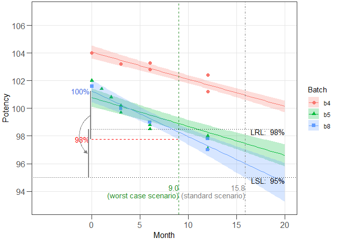

<!-- README.md is generated from README.Rmd. Please edit that file -->

# expirest

<!-- badges: start -->
<!-- badges: end -->

The package supports shelf life estimation for chemically derived
medicines, either following the standard method proposed by the
International Council for Harmonisation (ICH), in quality guideline [Q1E
Evaluation of Stability Data](https://www.ich.org/)) or following the
worst-case scenario consideration (what-if analysis) described in the
Australian Regulatory Guidelines for Prescription Medicines (ARGPM),
guidance on ([Stability testing for prescription
medicines](https://www.tga.gov.au/stability-testing-prescription-medicines)).

## Installation

A stable version of `expirest` can be installed from CRAN:

``` r
# install.packages("expirest")
```

The development version is available from
[GitHub](https://github.com/piusdahinden/expirest) by:

``` r
# install.packages("devtools")
devtools::install_github("piusdahinden/expirest")
```

## Example

### Example 1

This is a basic example which shows you how to solve a common problem
using a data set containing the moisture stability data (% (w/w)) of
three batches obtained over a 24 months period of a drug product. A
total of *n* = 33 independent measurements are available (corresponding
to data shown in Table XIII in [LeBlond et
al. (2011)](https://www.ivtnetwork.com/sites/default/files/LinearRegression.pdf)).

``` r
library(expirest)

# Data frame
str(exp3)
#> 'data.frame':    33 obs. of  3 variables:
#>  $ Batch   : Factor w/ 3 levels "b1","b2","b3": 1 1 1 1 1 1 1 1 1 1 ...
#>  $ Month   : num  0 1 2 3 3 6 6 12 12 24 ...
#>  $ Moisture: num  2.2 1.7 3.32 2.76 2.43 ...

# Perform what-if shelf life estimation (wisle) and print a summary
res1 <- expirest_wisle(
      data = exp3, response_vbl = "Moisture", time_vbl = "Month",
      batch_vbl = "Batch", rl = 3.00, rl_sf = 3, sl = c(0.5, 4.5),
      sl_sf = c(1, 2), srch_range = c(0, 500), alpha = 0.05,
      alpha_pool = 0.25, xform = c("no", "no"), shift = c(0, 0),
      sf_option = "tight", ivl = "confidence", ivl_type = "one.sided",
      ivl_side = "upper")

class(res1)
#> [1] "expirest_wisle"
summary(res1)
#> 
#> Summary of shelf life estimation following the ARGPM
#>   guidance "Stability testing for prescription medicines"
#> 
#> The best model accepted at a significance level of 0.25 has
#>  Common intercepts and Common slopes (acronym: cics).
#> 
#> Worst case intercept(s): 2.456782
#> Worst case batch(es): NA
#> 
#> Estimated shelf life (lives) for cics model:
#>       SL RL    wisle     osle
#> cics 4.5  3 72.50545 96.30552
#> 
#> Abbreviations:
#> ARGPM: Australian Regulatory Guidelines for Prescription Medicines; ICH: International Council for Harmonisation; osle: Ordinary shelf life estimation (i.e. following the ICH guidance); RL: Release Limit; SL: Specification Limit; wisle: What-if (approach for) shelf life estimation (i.e. following ARGPM guidance).

# Prepare graphical representation
ggres1 <- plot_expirest_wisle(
      model = res1, rl_index = 1, show_grouping = "no",
      response_vbl_unit = "% (w/w)", y_range = c(0.2, 5.2),
      x_range = NULL, scenario = "standard", plot_option = "full",
      ci_app = "ribbon")
class(ggres1)
#> [1] "plot_expirest_wisle"
plot(ggres1)
```


### Example 2

The model type in *Example 1* was *common intercept / common slope*
(cics). The model type in this example is *different intercept /
different slope* (dids). A data set containing the potency stability
data (in % of label claim (LC)) of five batches of a drug product
obtained over a 24 months period is used. A total of *n* = 53
independent measurements are available (corresponding to data shown in
Tables IV, VI and VIII in [LeBlond et
al. (2011)](https://www.ivtnetwork.com/sites/default/files/LinearRegression.pdf)).

``` r
library(expirest)

# Data frame
str(exp1)
#> 'data.frame':    53 obs. of  3 variables:
#>  $ Batch  : Factor w/ 6 levels "b2","b3","b4",..: 1 1 1 1 1 1 1 1 1 1 ...
#>  $ Month  : num  0 1 3 3 6 6 12 12 24 24 ...
#>  $ Potency: num  101 101.3 99.8 99.2 99.5 ...

# Perform what-if shelf life estimation (wisle) and print a summary
res1 <- expirest_wisle(
      data = exp1[exp1$Batch %in% c("b4", "b5", "b8"), ],
      response_vbl = "Potency", time_vbl = "Month", batch_vbl = "Batch",
      rl = c(98.0, 98.5, 99.0), rl_sf = rep(2, 3), sl = 95, sl_sf = 2,
      srch_range = c(0, 500), alpha = 0.05, alpha_pool = 0.25,
      xform = c("no", "no"), shift = c(0, 0), sf_option = "tight",
      ivl = "confidence", ivl_type = "one.sided", ivl_side = "lower")

summary(res1)
#> 
#> Summary of shelf life estimation following the ARGPM
#>   guidance "Stability testing for prescription medicines"
#> 
#> The best model accepted at a significance level of 0.25 has
#>  Different intercepts and Different slopes (acronym: dids).
#> 
#> Worst case intercept(s): 101.2594 101.2594 101.2594
#> Worst case batch(es): b8 b8 b8
#> 
#> Estimated shelf life (lives) for dids model:
#>   SL   RL     wisle     osle
#> 1 95 98.0  7.619661 15.84487
#> 2 95 98.5  8.997036 15.84487
#> 3 95 99.0 10.303030 15.84487
#> 
#> Abbreviations:
#> ARGPM: Australian Regulatory Guidelines for Prescription Medicines; ICH: International Council for Harmonisation; osle: Ordinary shelf life estimation (i.e. following the ICH guidance); RL: Release Limit; SL: Specification Limit; wisle: What-if (approach for) shelf life estimation (i.e. following ARGPM guidance).

# Prepare graphical representation
ggres1 <- plot_expirest_wisle(
      model = res1, rl_index = 2, show_grouping = "yes",
      response_vbl_unit = "%", y_range = c(93, 107),
      x_range = NULL, scenario = "standard", plot_option = "full",
      ci_app = "ribbon")
class(ggres1)
#> [1] "plot_expirest_wisle"
plot(ggres1)
#> Warning: Removed 4 rows containing missing values (geom_point).
```



## Contact

[Pius Dahinden](https://github.com/piusdahinden), Tillotts Pharma AG

------------------------------------------------------------------------
