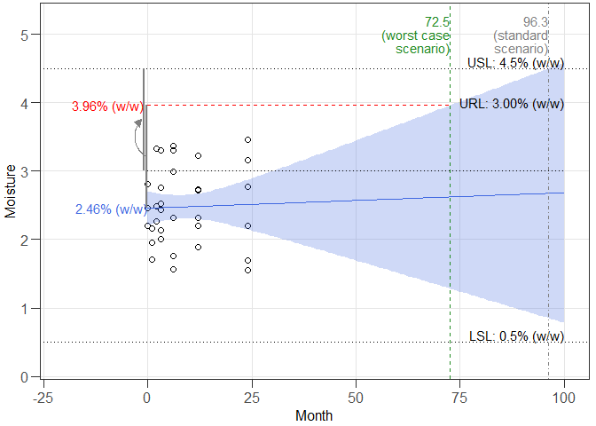
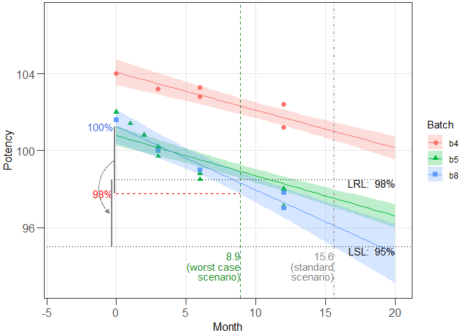
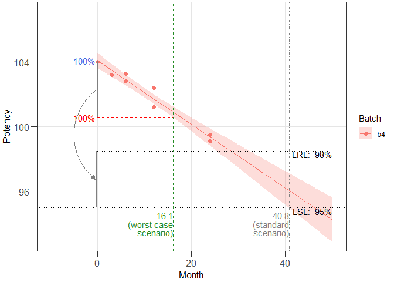

<!-- README.md is generated from README.Rmd. Please edit that file -->

# expirest

<!-- badges: start -->
<!-- badges: end -->

The package facilitates shelf life estimation for chemically derived
medicines by adhering to established methodologies. It supports both the
standard approach as recommended by the International Council for
Harmonisation (ICH) in the Q1E Evaluation of Stability Data guideline,
as well as the worst-case scenario analysis (what-if analysis) detailed
in the Australian Regulatory Guidelines for Prescription Medicines
(ARGPM) guidance on stability testing for prescription medicines.

## Installation

A stable version of `expirest` can be installed from CRAN:

``` r
# install.packages("expirest")
```

The development version is available from
[GitHub](https://github.com/piusdahinden/expirest) by:

``` r
# install.packages("devtools")
devtools::install_github("piusdahinden/expirest")
```

## Introduction

The ICH Q1E guideline outlines methods for estimating the retest period
or shelf life of chemically derived medicines. By analyzing the point in
time where the 95% confidence limit intersects the acceptance criterion,
shelf life estimation can be effectively performed. For attributes that
change over time, different approaches are used: one-sided limits for
those that increase and two-sided limits for those with uncertain
changes. Estimations can be applied to single or multiple batches, often
requiring stability data from at least three batches.

Before conducting shelf life estimation with multiple batches, it is
crucial to determine the most suitable model and verify if data from all
batches are poolable. The guideline recommends statistical tests to
assess whether regression lines from different batches share a common
intercept and slope. Depending on these tests, three models may be used:
common intercept / common slope (cics), different intercept / common
slope (dics), and different intercept / different slope (dids). Pooling
data only occurs if justified by statistical analysis, using a
significance level (Type I error) set at 0.25 to enhance the power of
the test to detect cases where the data should not be pooled.

The fourth possible model, i.e. the common intercept/different slope
model, is of limited practical relevance because, although initial
levels of different batches might be well-controlled, they are unlikely
to be identical.

## Examples

### Example 1

This is a basic example which shows you how to solve a common problem
using a data set containing the moisture stability data (% (w/w)) of
three batches obtained over a 24 months period of a drug product. A
total of *n* = 33 independent measurements are available (corresponding
to data shown in Table XIII in LeBlond et al. (2011).

``` r
library(expirest)

# Data frame
str(exp3)
#> 'data.frame':    33 obs. of  3 variables:
#>  $ Batch   : Factor w/ 3 levels "b1","b2","b3": 1 1 1 1 1 1 1 1 1 1 ...
#>  $ Month   : num  0 1 2 3 3 6 6 12 12 24 ...
#>  $ Moisture: num  2.2 1.7 3.32 2.76 2.43 ...

# Perform what-if shelf life estimation (wisle) and print a summary
res1 <- expirest_wisle(
      data = exp3, response_vbl = "Moisture", time_vbl = "Month",
      batch_vbl = "Batch", rl = 3.00, rl_sf = 3, sl = c(0.5, 4.5),
      sl_sf = c(1, 2), srch_range = c(0, 500), alpha = 0.05,
      alpha_pool = 0.25, xform = c("no", "no"), shift = c(0, 0),
      sf_option = "tight", ivl = "confidence", ivl_type = "one.sided",
      ivl_side = "upper")

class(res1)
#> [1] "expirest_wisle"
summary(res1)
#> 
#> Summary of shelf life estimation following the ARGPM
#>   guidance "Stability testing for prescription medicines"
#> 
#> The best model accepted at a significance level of 0.25 has
#>  Common intercepts and Common slopes (acronym: cics).
#> 
#> Worst case intercept and batch:
#>   RL Batch Intercept
#> 1  3    NA  2.456782
#> 
#> Estimated shelf lives for the cics model:
#>    SL RL    wisle     osle
#> 1 4.5  3 72.50545 96.30552
#> 
#> Abbreviations:
#>   ARGPM: Australian Regulatory Guidelines for Prescription Medicines;
#>   ICH: International Council for Harmonisation;
#>   osle: Ordinary shelf life estimation (i.e. following the ICH guidance);
#>   RL: Release Limit;
#>   SL: Specification Limit;
#>   wisle: What-if (approach for) shelf life estimation (see ARGPM guidance).

# Prepare graphical representation
ggres1 <- plot_expirest_wisle(
      model = res1, rl_index = 1, response_vbl_unit = "% (w/w)",
      x_range = NULL, y_range = c(0.2, 5.2), scenario = "standard",
      mtbs = "verified", plot_option = "full", ci_app = "ribbon")
class(ggres1)
#> [1] "plot_expirest_wisle"
plot(ggres1)
```



### Example 2

The model type in *Example 1* was *common intercept / common slope*
(cics). The model type in this example is *different intercept /
different slope* (dids). A data set containing the potency stability
data (in % of label claim (LC)) of five batches of a drug product
obtained over a 24 months period is used. A total of *n* = 53
independent measurements are available (corresponding to data shown in
Tables IV, VI and VIII in LeBlond et al. (2011).

``` r
# Data frame
str(exp1)
#> 'data.frame':    53 obs. of  3 variables:
#>  $ Batch  : Factor w/ 6 levels "b2","b3","b4",..: 1 1 1 1 1 1 1 1 1 1 ...
#>  $ Month  : num  0 1 3 3 6 6 12 12 24 24 ...
#>  $ Potency: num  101 101.3 99.8 99.2 99.5 ...

# Perform what-if shelf life estimation (wisle) and print a summary
res2_1 <- expirest_wisle(
      data = exp1[exp1$Batch %in% c("b4", "b5", "b8"), ],
      response_vbl = "Potency", time_vbl = "Month", batch_vbl = "Batch",
      rl = c(98.0, 98.5, 99.0), rl_sf = rep(2, 3), sl = 95, sl_sf = 2,
      srch_range = c(0, 500), alpha = 0.05, alpha_pool = 0.25,
      xform = c("no", "no"), shift = c(0, 0), sf_option = "tight",
      ivl = "confidence", ivl_type = "one.sided", ivl_side = "lower")

summary(res2_1)
#> 
#> Summary of shelf life estimation following the ARGPM
#>   guidance "Stability testing for prescription medicines"
#> 
#> The best model accepted at a significance level of 0.25 has
#>  Different intercepts and Different slopes (acronym: dids).
#> 
#> Worst case intercepts and batches:
#>     RL Batch Intercept
#> 1 98.0    b8  101.2594
#> 2 98.5    b8  101.2594
#> 3 99.0    b8  101.2594
#> 
#> Estimated shelf lives for the dids model (for information, the results of
#>   the model fitted with pooled mean square error (pmse) are also shown:
#>   SL   RL     wisle wisle (pmse)     osle osle (pmse)
#> 1 95 98.0  7.619661     7.483223 15.84487     15.6061
#> 2 95 98.5  8.997036     8.858223 15.84487     15.6061
#> 3 95 99.0 10.303030    11.344407 15.84487     15.6061
#> 
#> Abbreviations:
#>   ARGPM: Australian Regulatory Guidelines for Prescription Medicines;
#>   ICH: International Council for Harmonisation;
#>   osle: Ordinary shelf life estimation (i.e. following the ICH guidance);
#>   pmse: Pooled mean square error;
#>   RL: Release Limit;
#>   SL: Specification Limit;
#>   wisle: What-if (approach for) shelf life estimation (see ARGPM guidance).

# Prepare graphical representation
ggres2_1 <- plot_expirest_wisle(
      model = res2_1, rl_index = 2, response_vbl_unit = "%", x_range = NULL,
      y_range = c(93, 107), scenario = "standard", mtbs = "verified",
      plot_option = "full", ci_app = "ribbon")
class(ggres2_1)
#> [1] "plot_expirest_wisle"
plot(ggres2_1)
```


Note that if the model type is dids, then by default the results are
plotted that are obtained by fitting individual regression lines to each
batch. To get a plot of the dids model with pooled mean square error
(pmse) instead, use the setting `mtbs = "dids.pmse"`.

``` r
# Prepare graphical representation of the dids.pmse model
ggres2_2 <- plot_expirest_wisle(
      model = res2_1, rl_index = 2, response_vbl_unit = "%", x_range = NULL,
      y_range = c(93, 107), scenario = "standard", mtbs = "dids.pmse",
      plot_option = "full", ci_app = "ribbon")
plot(ggres2_2)
```



The examples above were performed with three batches. The assessment can
be performed with any numbers of batches, even with just one batch. If
the assessment is performed with a single batch, the results are
reported as dids model while the results for all other models are NA. As
an example, the following example was performed with batch b4.

``` r
# Perform what-if shelf life estimation (wisle) and print a summary
res2_2 <- expirest_wisle(
      data = exp1[exp1$Batch == "b4", ],
      response_vbl = "Potency", time_vbl = "Month", batch_vbl = "Batch",
      rl = c(98.0, 98.5, 99.0), rl_sf = rep(2, 3), sl = 95, sl_sf = 2,
      srch_range = c(0, 500), alpha = 0.05, alpha_pool = 0.25,
      xform = c("no", "no"), shift = c(0, 0), sf_option = "tight",
      ivl = "confidence", ivl_type = "one.sided", ivl_side = "lower")

summary(res2_2)
#> 
#> Summary of shelf life estimation following the ARGPM
#>   guidance "Stability testing for prescription medicines"
#> 
#> The best model accepted at a significance level of 0.25 has
#>  NA intercepts and NA slopes (acronym: n.a.).
#> 
#> Worst case intercepts and batches:
#>     RL Batch Intercept
#> 1 98.0    b4  104.0706
#> 2 98.5    b4  104.0706
#> 3 99.0    b4  104.0706
#> 
#> Estimated shelf lives for the n.a. model (for information, the results of
#>   the model fitted with pooled mean square error (pmse) are also shown:
#>   SL   RL    wisle wisle (pmse)     osle osle (pmse)
#> 1 95 98.0 13.72633           NA 40.79176          NA
#> 2 95 98.5 16.09778           NA 40.79176          NA
#> 3 95 99.0 18.40465           NA 40.79176          NA
#> 
#> Abbreviations:
#>   ARGPM: Australian Regulatory Guidelines for Prescription Medicines;
#>   ICH: International Council for Harmonisation;
#>   osle: Ordinary shelf life estimation (i.e. following the ICH guidance);
#>   pmse: Pooled mean square error;
#>   RL: Release Limit;
#>   SL: Specification Limit;
#>   wisle: What-if (approach for) shelf life estimation (see ARGPM guidance).

# Prepare graphical representation
ggres2_2 <- plot_expirest_wisle(
      model = res2_2, rl_index = 2, response_vbl_unit = "%", x_range = NULL,
      y_range = c(93, 107), scenario = "standard", mtbs = "verified",
      plot_option = "full", ci_app = "ribbon")
plot(ggres2_2)
```



### Example 3

The assessments in *Example 1* and *Example 2* were made with the option
`sf_option = "tight"`. The parameter `sf_option` affects the shelf life
(*sl*) and release limits (*rl*). The setting `sf_option = "tight"`
means that of the *sl* and *rl* limits only the number of significant
digits specified by the parameters `rl_sf` and `sl_sf`, respectively,
are taken into account. If `sf_option = "loose"`, then the limits are
widened, i.e. four on the order of the last significant digit + 1 is
added if `ivl_side = "upper"` or five on the order of the last
significant digit + 1 is subtracted if `ivl_side = "lower"`. For
illustration, the following example reproduces *Example 2* with the
option `sf_option = "loose"`.

``` r
# Perform what-if shelf life estimation (wisle) and print a summary
res3 <- expirest_wisle(
      data = exp1[exp1$Batch %in% c("b4", "b5", "b8"), ],
      response_vbl = "Potency", time_vbl = "Month", batch_vbl = "Batch",
      rl = c(98.0, 98.5, 99.0), rl_sf = rep(3, 3), sl = 95, sl_sf = 2,
      srch_range = c(0, 500), alpha = 0.05, alpha_pool = 0.25,
      xform = c("no", "no"), shift = c(0, 0), sf_option = "loose",
      ivl = "confidence", ivl_type = "one.sided", ivl_side = "lower")

summary(res3)
#> 
#> Summary of shelf life estimation following the ARGPM
#>   guidance "Stability testing for prescription medicines"
#> 
#> The best model accepted at a significance level of 0.25 has
#>  Different intercepts and Different slopes (acronym: dids).
#> 
#> Worst case intercepts and batches:
#>     RL Batch Intercept
#> 1 98.0    b8  101.2594
#> 2 98.5    b8  101.2594
#> 3 99.0    b8  101.2594
#> 
#> Estimated shelf lives for the dids model (for information, the results of
#>   the model fitted with pooled mean square error (pmse) are also shown:
#>   SL   RL     wisle wisle (pmse)    osle osle (pmse)
#> 1 95 98.0  8.863085     8.724968 17.0387    16.77679
#> 2 95 98.5 10.174754    11.221221 17.0387    16.77679
#> 3 95 99.0 11.440468    11.276686 17.0387    16.77679
#> 
#> Abbreviations:
#>   ARGPM: Australian Regulatory Guidelines for Prescription Medicines;
#>   ICH: International Council for Harmonisation;
#>   osle: Ordinary shelf life estimation (i.e. following the ICH guidance);
#>   pmse: Pooled mean square error;
#>   RL: Release Limit;
#>   SL: Specification Limit;
#>   wisle: What-if (approach for) shelf life estimation (see ARGPM guidance).

# Prepare graphical representation
ggres3 <- plot_expirest_wisle(
      model = res3, rl_index = 2, response_vbl_unit = "%", x_range = NULL,
      y_range = c(93, 107), scenario = "standard", mtbs = "verified",
      plot_option = "full", ci_app = "ribbon")
plot(ggres3)
```


## Literature

LeBlond, D., Griffith, D. and Aubuchon, K. Linear Regression 102:
Stability Shelf Life Estimation Using Analysis of Covariance. *J Valid
Technol* (2011) **17**(3): 47-68.

## Contact

[Pius Dahinden](https://github.com/piusdahinden), Tillotts Pharma AG

------------------------------------------------------------------------
